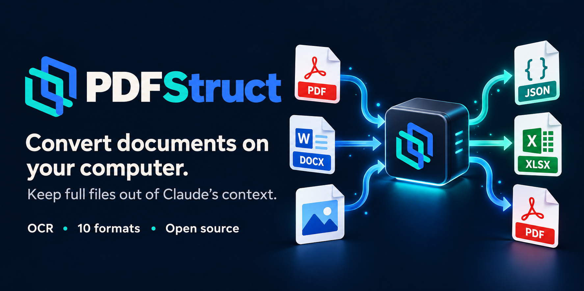

<p align="center">
  
</p>

# PDFStruct

**PDFStruct converts documents on your computer into structured data and ten output formats, without uploading them.**

[](https://github.com/KelesogluMustafa/pdfstruct/releases/latest)
[](https://github.com/KelesogluMustafa/pdfstruct/actions/workflows/ci.yml)
[](LICENSE)

**[Download for Windows](https://github.com/KelesogluMustafa/pdfstruct/releases/latest)** ·
**[Website](https://mustafakelesoglu.de/en/pdfstruct)** ·
**[Documentation](#documentation)**

| Download from the [latest release](https://github.com/KelesogluMustafa/pdfstruct/releases/latest) | File |
|---|---|
| **Portable** (no Python needed) | `PDFStruct-Portable-0.3.0-win64.zip` |
| **Windows Setup** (needs Python, required for Claude) | `PDFStruct-Windows-Setup-0.3.0.zip` |

## What is it?

PDFStruct reads PDF, DOCX, text and image files and writes them as JSON, HTML, TXT, Markdown,
CSV, XLSX, DOCX, JSONL, SQLite or PDF. Pages with real text are read directly; pages that are
only a picture go through OCR. It has a desktop window, a command line and a Claude
integration, and everything runs on your own computer.

## Why use it?

- **Nothing is uploaded.** No account, no payment, no telemetry, no usage limit.
- **Scans and mixed documents work.** Native text or OCR is chosen per page, and pages with
  low OCR confidence are listed for review.
- **One read, many formats.** Ask for XLSX, JSON and PDF together: the file is processed once.
- **Repeatable.** The same command gives the same result, for one file or a whole folder.
- **Built for Claude.** Claude starts the conversion and gets back a short status and the
  output paths, not the document.
- **Text to document.** Text written in a conversation is saved as a real DOCX, PDF, HTML,
  Markdown or TXT file.

It is for people who care where their documents go, developers building document workflows,
and Claude Desktop, Claude Code and Cowork users.

## Quick Start

### Portable (Windows, no Python)

1. Download `PDFStruct-Portable-0.3.0-win64.zip` from the
   [latest release](https://github.com/KelesogluMustafa/pdfstruct/releases/latest).
2. Extract it completely. Do not run it from inside the ZIP.
3. Run `PDFStruct.exe` (desktop window), `pdfstruct-cli.exe` (command line) or
   `pdfstruct-create.exe` (text to documents).

The build is unsigned, so Windows SmartScreen may warn on first start. Portable has no
updater and no Claude integration.

### Windows Setup (needs Python 3.10 to 3.13)

1. Install Python from [python.org](https://www.python.org/downloads/).
2. Download `PDFStruct-Windows-Setup-0.3.0.zip` from the
   [latest release](https://github.com/KelesogluMustafa/pdfstruct/releases/latest) and extract it.
3. Run `install-windows.cmd`.
4. Start the desktop window:

   ```
   %USERPROFILE%\.local\pdfstruct\current\Scripts\pdfstruct-gui.exe
   ```

The installer does not change your PATH and does not touch your system Python packages.
Update, rollback and uninstall: [Installation](docs/INSTALLATION.md).

## Installation

| Platform | Status | How |
|---|---|---|
| Windows 10/11 x64 | Supported. Desktop window tested by hand on Windows 11 | Portable or Windows Setup, see above |
| macOS, Linux | Command line and MCP server covered by automated tests. Desktop window not tested | The release wheel with pip, see [Installation](docs/INSTALLATION.md#pip-any-platform) |

OCR is not available on macOS Intel, Linux ARM64 and Windows ARM. PDFStruct is not published
on PyPI; install from the release files. The first OCR run downloads the OCR models once
(about 13 MB with the default models).

## Usage

With Windows Setup the commands are in `%USERPROFILE%\.local\pdfstruct\current\Scripts`; in the
portable folder use `pdfstruct-cli.exe` in place of `pdfstruct`.

```
pdfstruct                                             interactive menu: pick files, then formats
pdfstruct report.docx --format pdf                    one file, one format
pdfstruct scan.png --format txt,docx,pdf              one file, several formats, one OCR pass
pdfstruct "C:\Documents" --format json --all-types    every supported file in a folder
pdfstruct report.pdf --format txt --force-ocr         run OCR on every page
pdfstruct-create --name NOTES --format docx,pdf --content-file notes.md
```

Results go to an `output` folder next to each input. Source files are never overwritten.
All commands, flags and aliases: [CLI reference](docs/CLI_REFERENCE.md).

## Supported formats

| Inputs | Outputs |
|---|---|
| PDF, DOCX, TXT, Markdown, HTML | JSON, JSONL, SQLite, CSV, XLSX |
| JPG, PNG, TIFF, BMP, WebP | HTML, TXT, Markdown, DOCX, PDF |

Any input can go to any output, with one exception: a PDF is not written again as PDF.

## Use with Claude

Claude integrations need Windows Setup; Portable does not include the MCP server.

| You use | Install after Windows Setup |
|---|---|
| Claude Desktop chat | `pdfstruct-0.3.0.mcpb` (plus `pdfstruct-skill.zip` if you do not use the plugin) |
| Claude Code / Cowork | `pdfstruct-plugin.zip` |

Then ask, for example:

```
Convert C:\Documents\scan.png to PDF and TXT. Do not place document text in the conversation; return only the result and output paths.
```

Claude receives a compact status and the output paths. Document text is returned only when
you explicitly ask Claude to read or search it. Step-by-step setup, the MCP tools and
`create_document`: [Claude integration](docs/CLAUDE_INTEGRATION.md).

## Important limitations

- **CSV and XLSX** contain extracted text blocks, one per row. They are not reconstructed tables.
- **DOCX to PDF** and **created PDFs** are a readable reflow, not a pixel-perfect layout.
- **Same-format conversions** (DOCX to DOCX, Markdown to Markdown) keep the text, not the styling.
- PDFStruct does **not** summarize, understand meaning or extract fields such as invoice
  numbers. It produces reliable raw text and structure.
- **OCR runs on the CPU.** GPU use is not a ready, supported setup.
- **Non-Latin** OCR and PDF output are not ready defaults.
- **Not supported as input:** `.doc`, RTF, ODT, EPUB, PowerPoint, HEIC, CSV, XLSX.
- **Created documents** hold at most 500,000 characters; pictures are not embedded.

## Documentation

| Document | What is in it |
|---|---|
| [Installation](docs/INSTALLATION.md) | Windows Setup, update and rollback, portable, pip and source installs, uninstall |
| [Claude integration](docs/CLAUDE_INTEGRATION.md) | Extension, plugin, skill, MCP tools, `create_document`, rules for Claude |
| [CLI reference](docs/CLI_REFERENCE.md) | Commands, flags, aliases, output names, terminal output |
| [PDF pipeline reference](docs/PDF_PIPELINE_REFERENCE.md) | Native text or OCR, quality score, raw JSON, configuration, parsers |
| [Architecture](docs/MASTER_ARCHITECTURE.md) | Design, principles and rules for changes |
| [Changelog](CHANGELOG.md) | What changed in each version |

## Project Status

Version 0.3.0, alpha. Free and open source; all functionality is available without payment,
accounts, usage limits or tracking. The only network access is the one-time download of the
OCR models. Automated tests run on Windows, Ubuntu and macOS.

## License

[MIT](LICENSE). Third-party components keep their own licenses: see
[THIRD_PARTY_NOTICES.md](THIRD_PARTY_NOTICES.md).

## Support / Issues

Report problems you can reproduce in
[Issues](https://github.com/KelesogluMustafa/pdfstruct/issues); a small sample file helps.
Contributions are welcome: read the [architecture](docs/MASTER_ARCHITECTURE.md) first and run
`python scripts/ci_local.py` before opening a pull request.
